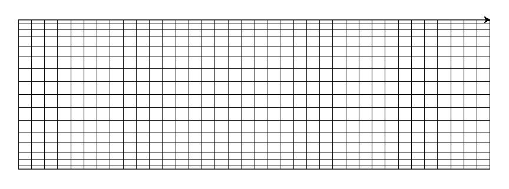

# Domácí úkol 1 - zobrazení

## Motivace
Vzpomeňte si na prváckou kartografii a na mapu zobrazení. Počítat polohu
jednotlivých bodů na mapě bylo na kalkulačce nepohodlné, GISy jste ještě
všichni neznali a tak to dalo docela práci. Protože se jedná o nudnou výpočetní
činnost, je nejpohodlnější si ji automatizovat pomocí programu.

## Zadání
Pro zvolené zobrazení a měřítko nakreslete pomocí želví grafiky souřadnicovou
síť a spočítejte souřadnice uživatelem zadaného bodu. Vyberte si jedno
azimutální, jedno válcové tečné, jedno kuželové a jedno nepravé ze [souboru
s definicemi zobrazení](zobrazeni_vzorce.pdf). Rovnoběžky i poledníky kreslete
po 10 stupních. Poloměr Země budiž pro tento úkol 6371,11 km.

Pokud si nejste v zobrazeních jistí, sepsal [stručný popis s
rovnicemi](zobrazeni.md). 

### Vstup 
Program bude interaktivní. Nejprve se zeptá uživatele na použité zobrazení,
odpovědí bude jedna z následujících:
 - `Gn` - Gnómonická projekce
 - `St` - Stereografická projekce
 - `Or` - Ortografická projekce
 - `La` - Lambertovo zobrazení azimutální
 - `Po` - Postelovo zobrazení
 - `Ma` - Marinovo zobrazení
 - `Lv` - Lambertovo zobrazení válcové
 - `Br` - Braunovo zobrazení
 - `Me` - Mercatorovo zobrazení
 - `Pt` - Ptolemaiovo zobrazení
 - `Lk` - Lambertovo zobrazení kuželové
 - `Be` - Behrmannovo zobrazení
 - `Ga` - Gallovo zobrazení
 - `Ct` - Čtvercové plochojevné
 - `Sa` - Sansonovo zobrazení
 - `We` - Werner-Stabovo zobrazení

Následně se zeptá uživatele na měřítko mapy, uživatel zadá číslo `x`, které bude
odpovídat měřítku 1:x, například pokud zadá 50000000, bude se počítat s měřítkem
1:50 000 000. Měřítko bude vždy celočíselné.

Nakonec se zeptá uživatele na zeměpisnou šířku a zeměpisnou délku bodu ve stupních.

### Výstup
Program vykreslí síť souřadnic v daném měřítku pomocí želví grafiky, pro naše
účely předpokládejme, že 1 pixel (tedy ta jednotka, ve které udáváte souřadnice
želvě) je 0.3 mm, tedy kratší strana A3 bude mít 891 px. Příklady výstupu viz
níže. Následně program vypíše převedené souřadnice zadaného bodu vůči
referenčnímu bodu  a počká, než uživatel klikne na okno s vykreslenou sítí
souřadnic a skončí. Převedené souřadnice zobrazujte jako `x` a `y` v mm,
respektive jako ε ve stupních a ρ v mm (dle typu zobrazení).

### Další požadavky
Program by se měl vypořádat s nekorektním vstupem v tom rozsahu, který zatím
umíte. Pokud například zadáte písmeno, které nekóduje žádné zobrazení, měl by
si program postěžovat a skončit.

Pokud vypadne výjimka z funkce `int` nebo `float`, nemusíte
ji ošetřovat (ani to zatím neumíte). V ostatních případech by ale program neměl
skončit výjimkou. Pokud si myslíte, že takový případ existuje, napište mi email.

### Doporučení
Pro načítání znaků použijte funkci `input`, pro převedení na čísla pak `float` a `int` 

Projděte si poznámky z cvičení, naleznete tam odpověď na mnoho ze svých otázek.

Projděte si [dokumentaci k modulu
`turtle`](https://docs.python.org/3/library/turtle.html), může se vám hodit
například funkce [`setpos`](https://docs.python.org/3/library/turtle.html).

Rozdělte si aplikaci do funkci, testujte nejprve, zda vám fungují jednotlivé
funkce a pak teprve celou aplikaci.

Funkci si můžete uložit do proměnné, voláte ji pak jako
`promenna(parametry,funkce)`

Testujte aplikaci nejen na korektní, ale i nekorektní vstupy.

Odevzdejte úkol pár dní i týden dopředu, ať mám čas vám ho zkontrolovat a případně
vrátit k dodělání / přepracování. 

Pište aplikaci jednoduše, nevytvářejte zbytečné vzdušné zámky. Napište si
nejprve funkční kostru, která např. nebere žádné paramtery od uživatele a umí
jen jedno zobrazení a pak dopisujte další funkcinalitu

Dodržujte princip "Nejprve načítám vstup a ověřuji, že je korektní, následně provádím výpočty"

Použijte Git či jiný verzovací systém, nebo si aspoň před tím, než smažete kus
kódu proto, že si myslíte, že je špatně, udělejte zálohu bokem.
 
Nebojte se zeptat. Pokud se na něčem zaseknete a nevíte, jak dál, klidně mi
napište, rád vám poradím.

### Odevzdání
Odevzdávat budete zdrojový kód projektu a soubor s dokumentací. Vše
bude zabalené v zip souboru, který bude obsahovat adresář `du1_jmeno_prijmeni`,
ve kterém bude soubor se zdrojovým kódem a soubor s dokumentací, tedy například:
```
du1.zip
|
\du1_tomas_pokorny
  |- dokumentace.md
  \- du1.py
```
Zip archiv mi pošlete mailem. 

Deadline bude 22.11. 8.03. Úkoly odeslané po deadlinu budou brány jako neodevzdané. Pokud
odevzdáte úkol vícekrát, budu hodnotit poslední odevzdání před deadlinem.
Každému, kdo mi pošle úkol, odpovím, že jsem ho přijal a že se mi podařilo zip
rozbalit. Pokud neodpovím, urgujte.

Detaily pro odevzdání přes GitHub viz sekce *Odevzdání přes GitHub*.

### Předčasné odevzdání
Pokud odevzdáte úkol dopředu, zkusím se na něj podívat a napsat vám případné
nedostatky. Tato možnost není garantovaná, ale budu se snažit odbavovat úkoly co
nejrychleji. Zaručuji vám pouze to, že na úkoly se budu dívat v tom pořadí, v
jakém mi budou doručeny. Rovněž nezaručuji, že najdu v programu všechny chyby
napoprvé, tudíž pokud si nějaké nevšimnu, není to garance, že máte program
správně, závazné je pouze hodnocení po deadlinu. Pokud budete odevzdávat přes
GitHub, chyby vám vystavím jako Issue.

### Bodování
- 1 b za funkční válcové zobrazení
- 1 b za funkční azimutální zobrazení
- 2 b za funkční kuželové zobrazení
- 2 b za funkční nepravé zobrazení 
- 2 b za kvalitu kódu
- 1 b za komentáře v kódu
- 1 b za dokumentaci
 
Kvalitou kódu se rozumí použití vhodných prostředků k dosažení cíle,
minimalizace opakujícího se kódu, vhodné odsazení a oddělení funkčních celků,
použití funkcí tam, kde to dává smysl.
 
Komentáře v kódu jsou důležité, aby člověk, co si váš kód čte, získal přehled o
tom, co kód dělá. Nekomentujte každý řádek, ale jednotlivé funkční celky. Pokud
používáte metody (a že byste měli), u každé napište, jaké má vstupy a co vrací
jako výstup, ideálně jako [Docstring](https://www.python.org/dev/peps/pep-0257/).
Komentářů by mělo být výrazně méně než kódu.
 
Dokumentací se rozumí textový soubor (ve formě čistého textu, např. .txt), kde
bude popsána fuknčnost programu, funkce programu a stručný popis, jak program
pracuje. Nepište romány, mělo by stačit 50 -- 75 řádků při 80 znacích na řádek.
Neopisujte přesně zadání, jen ho stručně shrňte, zadání si může každý přečíst
tady. Soubor vhodně formátujte, například pomocí
[MarkDownu](https://github.com/adam-p/markdown-here/wiki/Markdown-Cheatsheet),
inspiraci si vezměte například z tohoto souboru.

Postup, jak domácí úkol napsat, spolu klidně konzultujte, ale kód pište každý
sám. Pokud objevím identické či nápadně podobné řešení, oboduji je jednou a body
rovnoměrně rozdělím mezi autory. 

### Vzorové obrázky
 - Lambertovo zobrazení 
## Bonusové body

Za různé nadstavby k zadání můžete získat bonusové body. Bonusové body se
počítají pouze tehdy, pokud bude program fungovat korektně včetně ošetření
všech nesprávných vstupů, i těch z bonusové části. Pokud je chyba pouze v
bonusové části (bude hodnoceno individuálně), pak se aplikace považuje za
funkční a propadají pouze body z bonusové části.

### Odevzdání před GitHub (1 b)

Pokud budete pro verzování používat Git, vytvořte si účet na
[GitHubu](https://github.com) nebo jiné podobné platformě a úkol můžete odevzdat
přes něj. Repozitář by měl obsahovat jak program, tak případný soubor s
dokumentací, za hodnocenou verzi se počítá poslední commit pushnutý na GitHub
před deadlinem. Pokud budete potřebovat pomoct, pište mi.

### Volitelný poloměr Země (1 b)

Program se po zadání zobrazení a měřítka zeptá na poloměr Země a použije ten,
který mu zadá uživatel. Pokud uživatel zadá 0, pak se použije poloměr ze zadání.

### Výpočet souřadnic bodů (1 b)

Program se nezeptá na souřadnice jen jednou, ale bude se ptát opakovaně, dokud
uživatel nezadá souřadnice (0,0). Po každém zadání souřadnic program vypíše
přepočtené souřadnice.

### Více zobrazení z každé kategorie (0,5 b za kategorii)

Program bude podporovat více zobrazení z jednotlivých kategorií, za každou
kategorii, která podporuje více zobrazení 0,5 b, zaokrouhluje se dolů na celé
body.

### Volitelný počet rovnoběžek a poledníků (1 b)

Program se po zadání zobrazení, měřítka a případného poloměru zeptá na to, po
kolika stupních má kreslit rovnoběžky a po kolika stupních má kreslit poledníky.
Pokud uživatel zadá 0, bere se výchozí hodnota ze zadání (10 stupňů) 

### Volitelná přesnost vykreslování (2 b)

Program umožní si zvolit přesnost vykreslování, tedy jak moc budou křivky
"lomené". Přesná implementace je na vás, parametr by měl mít rozsah 0-100, kdy
pro 0 budou křivky velmi hranaté a pro 100 by měly vypadat velmi věrohodně.
